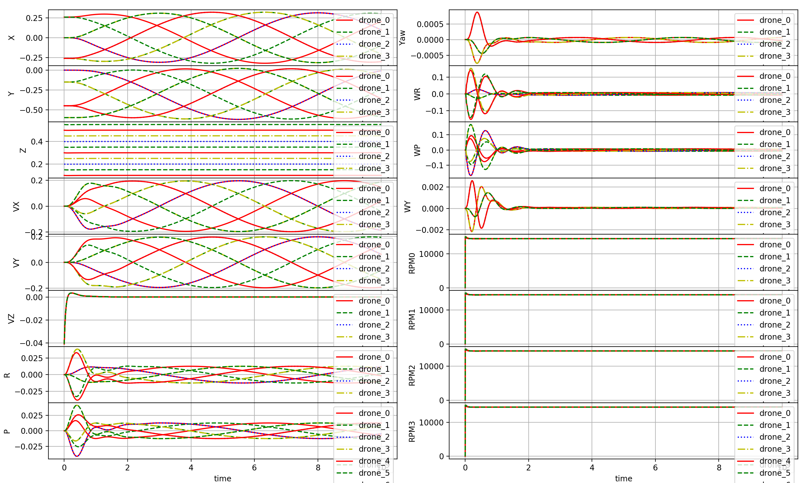
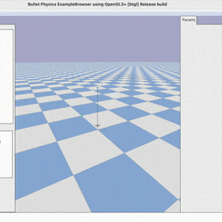

> [!TIP]
> For research work with **symbolic dynamics and constraints**, also try [`safe-control-gym`](https://github.com/learnsyslab/safe-control-gym)
>
> For GPU-accelerated, **differentiable, JAX-based simulation**, also try [`crazyflow`](https://github.com/learnsyslab/crazyflow)
>
> For production-grade deployment of **ROS2 + PX4/ArduPilot + YOLO/LiDAR**, use [`aerial-autonomy-stack`](https://github.com/JacopoPan/aerial-autonomy-stack)

# gym-pybullet-drones

This is a minimalist refactoring of the original `gym-pybullet-drones` repository, designed for compatibility with [`gymnasium`](https://github.com/Farama-Foundation/Gymnasium), [`stable-baselines3` 2.0](https://github.com/DLR-RM/stable-baselines3/pull/1327), and [`betaflight`](https://github.com/betaflight/betaflight)/[`crazyflie-firmware`](https://github.com/bitcraze/crazyflie-firmware/) SITL.

## Local Research Overlay

本工作区在上游 `gym-pybullet-drones` 基础上增加了一个本地研究方向：**未知随机扰动下四旋翼匀速圆周轨迹跟踪的 PID、端到端 Direct TD3 与 PID-based Residual TD3 公平对比**。

> **Research reset, 2026-07-10:** 旧的 oracle 扰动观测、PID-FF imitation warm-start 和 gate-min 路线已经停止。新论文不向任何控制器提供真实环境扰动参数；普通 PID 只依靠闭环反馈和积分作用，Residual TD3 只学习 PID 未能消除的未知动态残差。

后续人类工作者或智能体请优先阅读：

- [`AGENTS.md`](AGENTS.md): 给接手智能体的工作规则和文档入口。
- [`PROJECT_HANDOFF.md`](PROJECT_HANDOFF.md): 项目主线、已有材料和推荐接手顺序。
- [`PROJECT_STRUCTURE.md`](PROJECT_STRUCTURE.md): 当前文件架构。
- [`RL_PAPER_EXECUTION_PLAN.md`](RL_PAPER_EXECUTION_PLAN.md): 新论文唯一主计划，包含旧方案失败原因、三控制器信息边界、分阶段训练和 GO/NO-GO 标准。
- [`.research/design_brief.md`](.research/design_brief.md): 可证伪研究问题、机制、可识别性、验证方案和风险登记。
- [`docs/superpowers/plans/2026-07-10-hidden-disturbance-td3-paper-rebuild.md`](docs/superpowers/plans/2026-07-10-hidden-disturbance-td3-paper-rebuild.md): 逐测试、逐文件的实施计划。

当前研究主线位于 `experiments/circular_tracking/`。其中 `simulink_residual_rl/` 是从干扰环境仿真项目复制进来的旧 Simulink 圆周抗扰残差强化学习包，包含 RL-v1、RL-v2、多控制器对比、指标和报告。旧 PyBullet oracle/PID-FF pilot 位于 `experiments/circular_tracking/results/td3_residual_paper/`。二者都只能作为背景或失败诊断，不能与新 hidden-disturbance 主实验数字混表。

新实验尚未实现。接手者必须先修复并测试 terminal failure reward，重新整定能真正完成圆周的 PID，建立不泄露扰动真值的统一 observation/action 接口；这些验收通过前不要启动 20k、50k 或 100k TD3 训练。新结果统一写入：

```text
experiments/circular_tracking/results/hidden_disturbance_td3_paper/
```

> **NEWS**: `gym-pybullet-drones` was featured in [GitHub's Maintainer Spotlight 2026](https://maintainermonth.github.com/academia/gym-pybullet-drones-maintainer-spotlight)

> **NOTE**: if you want to access the original codebase, presented at IROS in 2021, please `git checkout [paper|master]`

 

## Installation

Tested on Intel x64/Ubuntu 22.04 and Apple Silicon/macOS 26.2.

```sh
git clone https://github.com/learnsyslab/gym-pybullet-drones.git
cd gym-pybullet-drones/

conda create -n drones python=3.10
conda activate drones

pip3 install -e . # if needed, `sudo apt install build-essential` to install `gcc` and build `pybullet`

# check installed packages with `conda list`, deactivate with `conda deactivate`, remove with `conda remove -n drones --all`
```

## Use

### PID control examples

```sh
cd gym_pybullet_drones/examples/
python3 pid.py # position and velocity reference
python3 pid_velocity.py # desired velocity reference
```

### Downwash effect example

```sh
cd gym_pybullet_drones/examples/
python3 downwash.py
```

### Reinforcement learning examples (SB3's PPO)

```sh
cd gym_pybullet_drones/examples/
python learn.py # task: single drone hover at z == 1.0
python learn.py --multiagent true # task: 2-drone hover at z == 1.2 and 0.7

LATEST_MODEL=$(ls -t results | head -n 1) && python play.py --model_path "results/${LATEST_MODEL}/best_model.zip" # play and visualize the most recent learned policy after training
```

 

### Run all tests

```sh
# from the repo's top folder
cd gym-pybullet-drones/
pytest tests/
```

### Betaflight SITL example (Ubuntu only)

```sh
git clone https://github.com/betaflight/betaflight 
cd betaflight/
git checkout cafe727 # `master` branch head at the time of writing (future release 4.5)
make arm_sdk_install # if needed, `apt install curl``
make TARGET=SITL # comment out line: https://github.com/betaflight/betaflight/blob/master/src/main/main.c#L52
cp ~/gym-pybullet-drones/gym_pybullet_drones/assets/eeprom.bin ~/betaflight/ # assuming both gym-pybullet-drones/ and betaflight/ were cloned in ~/
betaflight/obj/main/betaflight_SITL.elf
```

In another terminal, run the example

```sh
conda activate drones
cd gym_pybullet_drones/examples/
python3 beta.py --num_drones 1 # check the steps in the file's docstrings to use multiple drones
```

### `pycffirmware` Python Bindings example (multiplatform, single-drone)

First, install [`pycffirmware`](https://github.com/learnsyslab/pycffirmware?tab=readme-ov-file#installation) for Ubuntu, macOS, or Windows, then

```sh
cd gym_pybullet_drones/examples/
python3 cf.py
```

## Citation

If you wish, please cite our [IROS 2021 paper](https://arxiv.org/abs/2103.02142) ([and original codebase](https://github.com/learnsyslab/gym-pybullet-drones/tree/paper)) as

```bibtex
@INPROCEEDINGS{panerati2021learning,
      title={Learning to Fly---a Gym Environment with PyBullet Physics for Reinforcement Learning of Multi-agent Quadcopter Control}, 
      author={Jacopo Panerati and Hehui Zheng and SiQi Zhou and James Xu and Amanda Prorok and Angela P. Schoellig},
      booktitle={2021 IEEE/RSJ International Conference on Intelligent Robots and Systems (IROS)},
      year={2021},
      volume={},
      number={},
      pages={7512-7519},
      doi={10.1109/IROS51168.2021.9635857}
}
```

## References

- Erwin Coumans and Yunfei Bai (2023) [*PyBullet Quickstart Guide*](https://docs.google.com/document/d/10sXEhzFRSnvFcl3XxNGhnD4N2SedqwdAvK3dsihxVUA/edit?tab=t.0#heading=h.2ye70wns7io3)
- Carlos Luis and Jeroome Le Ny (2016) [*Design of a Trajectory Tracking Controller for a Nanoquadcopter*](https://arxiv.org/pdf/1608.05786.pdf)
- Nathan Michael, Daniel Mellinger, Quentin Lindsey, Vijay Kumar (2010) [*The GRASP Multiple Micro-UAV Testbed*](https://ieeexplore.ieee.org/document/5569026)
- Benoit Landry (2014) [*Planning and Control for Quadrotor Flight through Cluttered Environments*](http://groups.csail.mit.edu/robotics-center/public_papers/Landry15)
- Julian Forster (2015) [*System Identification of the Crazyflie 2.0 Nano Quadrocopter*](https://www.research-collection.ethz.ch/handle/20.500.11850/214143)
- Antonin Raffin, Ashley Hill, Maximilian Ernestus, Adam Gleave, Anssi Kanervisto, and Noah Dormann (2019) [*Stable Baselines3*](https://github.com/DLR-RM/stable-baselines3)
- Guanya Shi, Xichen Shi, Michael O’Connell, Rose Yu, Kamyar Azizzadenesheli, Animashree Anandkumar, Yisong Yue, and Soon-Jo Chung (2019)
[*Neural Lander: Stable Drone Landing Control Using Learned Dynamics*](https://arxiv.org/pdf/1811.08027.pdf)
- C. Karen Liu and Dan Negrut (2020) [*The Role of Physics-Based Simulators in Robotics*](https://www.annualreviews.org/doi/pdf/10.1146/annurev-control-072220-093055)
- Yunlong Song, Selim Naji, Elia Kaufmann, Antonio Loquercio, and Davide Scaramuzza (2020) [*Flightmare: A Flexible Quadrotor Simulator*](https://arxiv.org/pdf/2009.00563.pdf)

-----
> UTIAS / [Learning Systems and Robotics Lab](https://github.com/learnsyslab) / [Vector Institute](https://github.com/VectorInstitute) / University of Cambridge's [Prorok Lab](https://github.com/proroklab)

<!--
## WIP/Desired Contributions/PRs

- [ ] Multi-drone `crazyflie-firmware` SITL support
- [ ] Use SITL services with steppable simulation
- [ ] Add motor delay, advanced ESC modeling by implementing a buffer in `BaseAviary._dynamics()`
- [ ] Replace `rpy` with quaternions (and `ang_vel` with body rates) by editing `BaseAviary._updateAndStoreKinematicInformation()`, `BaseAviary._getDroneStateVector()`, and the `.computeObs()` methods of relevant subclasses

## Troubleshooting

- On Ubuntu, with an NVIDIA card, if you receive a "Failed to create and OpenGL context" message, launch `nvidia-settings` and under "PRIME Profiles" select "NVIDIA (Performance Mode)", reboot and try again.
-->
