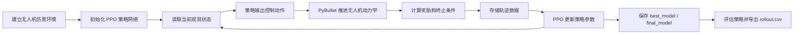

# gym-pybullet-drones 强化学习控制项目参观说明

## 1. 项目定位

本项目围绕“四旋翼无人机悬停控制”开展强化学习控制复现与研究。基础平台来自 `learnsyslab/gym-pybullet-drones`，它把 PyBullet 物理仿真、Gymnasium 强化学习接口和 Stable-Baselines3 算法库连接起来，使研究者可以在本机或 Docker 容器中训练无人机控制策略。

当前复现任务是单架四旋翼无人机从初始状态出发，学习悬停到目标位置：

```text
x = 0, y = 0, z = 1
```

项目不是直接手写一个传统 PID 控制器，而是让智能体在仿真环境中反复试飞，通过奖励反馈学习“观测状态到电机动作”的控制策略。

## 2. 项目已经完成的工作

本地工作目录：

```powershell
E:\1-AI辅助工作\科研项目\强化学习\gym-pybullet-drones
```

已完成内容包括：

- 已准备 Docker 复现环境：`reproducibility/docker/Dockerfile.repro`。
- 已添加短训练脚本：`experiments/hover_rl_reproduction/scripts/reproduce_hover_short.py`。
- 已跑通 PPO 强化学习训练、模型保存、模型评估和轨迹导出。
- 已验证官方示例 `gym_pybullet_drones/examples/learn.py` 可以运行。
- 已生成短训练结果：`experiments/hover_rl_reproduction/results/repro_hover_short`。
- 已生成 100000 步扩展训练结果：`experiments/hover_rl_reproduction/results/repro_hover_100k`。

短训练结果摘要如下：

```text
task: single_drone_hover
algorithm: PPO
observation: kin
action: one_d_rpm
timesteps: 2048
mean_reward: 355.7683
std_reward: 0.1818
rollout_steps: 240
final_z: 0.2163
```

这里的短训练主要用于验证链路：环境能创建、算法能训练、模型能保存、结果能导出。由于训练步数较少，最终高度还没有接近目标高度 `z = 1.0`，因此它不是最终控制效果，而是一个可复现实验起点。

## 3. 强化学习整体工作流程

强化学习控制的整体流程可以理解为“环境给状态，策略给动作，物理仿真推进一步，奖励函数评价动作好坏，然后算法更新策略”。



本项目中，这个流程对应到具体文件：

- `gym_pybullet_drones/envs/HoverAviary.py`：定义单机悬停任务，包括目标位置、奖励函数和终止条件。
- `gym_pybullet_drones/envs/BaseRLAviary.py`：定义强化学习接口，包括动作空间、观测空间和动作预处理。
- `gym_pybullet_drones/examples/learn.py`：官方 PPO 训练、评估和播放示例。
- `experiments/hover_rl_reproduction/scripts/reproduce_hover_short.py`：本项目新增的最小复现脚本，适合快速验证环境。
- `experiments/hover_rl_reproduction/results/.../summary.json`：每次实验的摘要。
- `experiments/hover_rl_reproduction/results/.../rollout.csv`：测试飞行轨迹，可用 Excel 或 Python 画图分析。

## 4. 强化学习任务建模

### 4.1 智能体

智能体是 PPO 策略网络。它接收无人机当前状态，输出控制动作。训练完成后，保存下来的 `.zip` 模型可以理解为“学习得到的控制器”。

### 4.2 环境

环境是 `HoverAviary`。它封装了四旋翼模型、PyBullet 物理仿真、目标位置、奖励计算和回合结束规则。

### 4.3 观测状态

当前复现使用 `kin` 类型观测。观测包含无人机位置、姿态、速度、角速度以及一段历史动作缓存。简化理解时，可以重点关注：

```text
position = [x, y, z]
attitude = [roll, pitch, yaw]
velocity = [vx, vy, vz]
angular_velocity = [wx, wy, wz]
```

### 4.4 控制动作

当前复现使用 `one_d_rpm` 动作类型。智能体只输出一个标量动作，环境把它转换为四个电机共同变化的转速命令：

```text
rpm_i = hover_rpm * (1 + 0.05 * action)
```

这种设置降低了入门难度，适合先研究高度悬停。如果后续要实现完整三维位置控制，可以改用 `rpm`、`pid`、`vel` 等动作类型。

### 4.5 奖励函数

悬停任务的奖励函数鼓励无人机靠近目标点：

```text
reward = max(0, 2 - ||target_position - current_position||^4)
```

无人机越接近目标点，距离项越小，奖励越高。这个奖励函数在 `HoverAviary.py` 的 `_computeReward()` 中实现。

### 4.6 回合终止与截断

环境在以下情况下结束或截断一次试飞：

- 无人机非常接近目标点，认为任务完成。
- 飞得过远，例如横向位置超过限制。
- 高度超过限制。
- 姿态倾角过大。
- 回合时间超过 8 秒。

这些规则保证训练不会在明显失控的状态下无限继续。

## 5. 软件环境配置

推荐使用 Docker 路线，因为它能绕开 Windows 原生 Python 和 PyBullet 编译问题。

### 5.1 必需软件

- Windows 10/11。
- Docker Desktop。
- PowerShell。
- Git，可选但建议安装。
- VS Code 或 PyCharm，可选，用于阅读代码。

### 5.2 容器内主要依赖

项目依赖在 `pyproject.toml` 中声明，核心包括：

- Python 3.10。
- numpy。
- scipy。
- matplotlib。
- pybullet。
- gymnasium。
- stable-baselines3。
- torch，由 stable-baselines3 间接使用。
- pytest。

### 5.3 构建 Docker 镜像

进入项目目录：

```powershell
cd E:\1-AI辅助工作\科研项目\强化学习\gym-pybullet-drones
```

构建镜像：

```powershell
docker build -f reproducibility/docker/Dockerfile.repro -t gym-pybullet-drones-repro .
```

第一次构建可能较慢，因为需要下载 Python 依赖和 PyTorch 相关包。

## 6. 一步一步复现实验

### 6.1 快速短训练

运行：

```powershell
docker run --rm -v "${PWD}\experiments\hover_rl_reproduction\scripts\reproduce_hover_short.py:/workspace/experiments/hover_rl_reproduction/scripts/reproduce_hover_short.py:ro" -v "${PWD}\experiments\hover_rl_reproduction\results:/workspace/experiments/hover_rl_reproduction/results" gym-pybullet-drones-repro python experiments/hover_rl_reproduction/scripts/reproduce_hover_short.py --timesteps 2048 --eval-episodes 3 --rollout-steps 240 --output-folder experiments/hover_rl_reproduction/results/repro_hover_short
```

运行后检查：

```powershell
dir experiments\hover_rl_reproduction\results\repro_hover_short
```

应该看到：

```text
ppo_hover_short.zip
summary.json
rollout.csv
```

### 6.2 查看实验摘要

```powershell
Get-Content experiments\hover_rl_reproduction\results\repro_hover_short\summary.json
```

重点关注：

- `mean_reward`：平均奖励，通常越高越好。
- `std_reward`：奖励波动，越小代表评估结果越稳定。
- `final_z`：测试轨迹最后一步高度。
- `rollout_csv`：轨迹文件路径。

### 6.3 查看飞行轨迹

用 Excel 打开：

```powershell
experiments\hover_rl_reproduction\results\repro_hover_short\rollout.csv
```

重点看 `z` 列是否逐步接近 `1.0`。如果训练步数较短，`z` 不接近 1.0 是正常现象。

### 6.4 运行官方 PPO 示例

```powershell
docker run --rm -v "${PWD}\experiments\hover_rl_reproduction\results:/workspace/experiments/hover_rl_reproduction/results" gym-pybullet-drones-repro python -c "from gym_pybullet_drones.examples.learn import run; run(gui=False, plot=False, local=False, output_folder='experiments/hover_rl_reproduction/results/original_learn_quick')"
```

这个命令运行官方 `learn.py` 的快速模式，用于验证原项目示例也能完整执行。

### 6.5 增加训练步数

```powershell
docker run --rm -v "${PWD}\experiments\hover_rl_reproduction\scripts\reproduce_hover_short.py:/workspace/experiments/hover_rl_reproduction/scripts/reproduce_hover_short.py:ro" -v "${PWD}\experiments\hover_rl_reproduction\results:/workspace/experiments/hover_rl_reproduction/results" gym-pybullet-drones-repro python experiments/hover_rl_reproduction/scripts/reproduce_hover_short.py --timesteps 100000 --eval-episodes 5 --rollout-steps 240 --output-folder experiments/hover_rl_reproduction/results/repro_hover_100k
```

强化学习训练有随机性。更长训练不一定每次都单调变好，因此要多次重复实验，并记录随机种子、奖励曲线和轨迹表现。

## 7. 基于强化学习的控制研究总体思路

本项目可以从“复现演示”进一步发展为“可发表或可展示的控制研究”。总体思路建议分为六步。

### 7.1 明确控制目标

第一阶段聚焦单机定点悬停。评价指标包括：

- 位置误差。
- 高度误差。
- 姿态稳定性。
- 平均奖励。
- 成功率。
- 收敛速度。
- 控制动作平滑程度。

第二阶段扩展到轨迹跟踪，例如圆形、螺旋线、阶跃高度变化。

第三阶段扩展到抗扰控制，例如加入风扰、质量变化、传感器噪声或电机延迟。

### 7.2 建立基准控制器

强化学习控制研究不能只展示 RL 模型，还应设置传统控制基线。推荐至少比较：

- PID 控制。
- 项目自带 `DSLPIDControl`。
- PPO 强化学习策略。
- 可选：SAC、TD3 或安全强化学习方法。

这样才能说明强化学习在什么情况下优于传统控制，或者在哪些情况下仍然不稳定。

### 7.3 设计状态、动作和奖励

初始阶段使用 `kin` 观测和 `one_d_rpm` 动作，降低问题难度。后续研究可以逐步扩展：

- 状态从纯运动学扩展到传感器噪声状态。
- 动作从一维转速扩展到四电机独立转速。
- 奖励从距离奖励扩展为“位置误差 + 姿态误差 + 能耗 + 动作平滑”的组合奖励。

一个更完整的控制奖励可以写成：

```text
reward = w_p * position_score - w_u * action_cost - w_a * attitude_cost - w_s * smoothness_cost
```

其中 `w_p`、`w_u`、`w_a`、`w_s` 是权重。这样可以避免策略只追求靠近目标，却产生过大动作或不稳定姿态。

### 7.4 制定训练实验矩阵

建议至少记录以下实验变量：

```text
algorithm: PPO / SAC / TD3
observation: kin / rgb
action: one_d_rpm / rpm / pid / vel
timesteps: 1e5 / 5e5 / 1e6 / 1e7
seed: 0 / 1 / 2 / 3 / 4
disturbance: none / wind / noise / delay
```

每组实验输出同样的 `summary.json`、模型文件和轨迹文件，便于后续对比。

### 7.5 评估与可视化

建议形成固定评估表：

- 平均回合奖励。
- 最终位置误差。
- 最大位置误差。
- 稳态高度误差。
- 超调量。
- 回合成功率。
- 动作变化率。
- 是否触发截断。

建议形成固定图表：

- 训练步数与平均奖励曲线。
- `x, y, z` 位置随时间变化曲线。
- 高度误差随时间变化曲线。
- 控制动作随时间变化曲线。
- 多算法对比柱状图或箱线图。

### 7.6 从仿真走向真实控制

真实部署前必须经过安全路线：

1. 在 PyBullet 中训练和评估。
2. 加入随机化扰动，提高策略鲁棒性。
3. 与 PID 控制器混合，例如 RL 只输出高层速度或位置目标，底层由 PID 保证稳定。
4. 在 SITL 中测试，例如 Betaflight SITL 或 Crazyflie firmware。
5. 小范围低速实机测试。
6. 增加安全边界、急停逻辑和人工接管机制。

## 8. 参观者如何理解这个项目

可以按照下面的顺序讲解：

1. 先展示项目目标：让无人机学会悬停到 `z = 1.0`。
2. 打开 `HoverAviary.py`，说明目标位置和奖励函数在哪里。
3. 打开 `BaseRLAviary.py`，说明状态和动作如何进入强化学习接口。
4. 打开 `experiments/hover_rl_reproduction/scripts/reproduce_hover_short.py`，说明 PPO 如何创建、训练、评估和保存。
5. 打开 `summary.json`，说明实验结果如何记录。
6. 打开 `rollout.csv`，说明轨迹数据如何验证飞行表现。
7. 最后说明后续研究方向：更长训练、更复杂动作空间、抗扰控制、多算法对比和仿真到实机迁移。

## 9. 常见问题

### 9.1 为什么用 Docker

Windows 原生环境中 PyBullet、Python 版本和编译工具链容易不匹配。Docker 提供 Linux + Python 3.10 的稳定环境，便于别人复现。

### 9.2 为什么短训练效果还不好

强化学习需要大量试错。2048 步只是快速验证，不能代表最终策略质量。要得到高质量控制器，需要几十万到数百万步训练，并进行多随机种子评估。

### 9.3 为什么选择 PPO

PPO 是稳定、易用、工程成熟的强化学习算法，Stable-Baselines3 对它支持很好。它适合先跑通连续控制任务，再作为后续算法对比的基线。

### 9.4 后续最值得做什么

优先建议做三件事：

1. 把训练步数提高到 `1e6` 以上，并保存奖励曲线。
2. 修改奖励函数，加入姿态稳定和动作平滑惩罚。
3. 与 PID 控制器做同一轨迹、同一扰动条件下的对比。

## 10. 项目文件导览

```text
gym-pybullet-drones/
├── reproducibility/docker/Dockerfile.repro
├── experiments/hover_rl_reproduction/scripts/reproduce_hover_short.py
├── pyproject.toml
├── gym_pybullet_drones/
│   ├── envs/
│   │   ├── HoverAviary.py
│   │   ├── MultiHoverAviary.py
│   │   ├── BaseRLAviary.py
│   │   └── BaseAviary.py
│   ├── examples/
│   │   ├── learn.py
│   │   └── play.py
│   └── control/
│       └── DSLPIDControl.py
├── results/
│   ├── repro_hover_short/
│   │   ├── ppo_hover_short.zip
│   │   ├── summary.json
│   │   └── rollout.csv
│   └── repro_hover_100k/
└── docs/
    └── 强化学习控制项目参观说明.md
```

这份文档的核心作用是帮助参观者快速回答三个问题：这个项目在做什么、它如何跑起来、下一步如何把它发展成强化学习控制研究。
